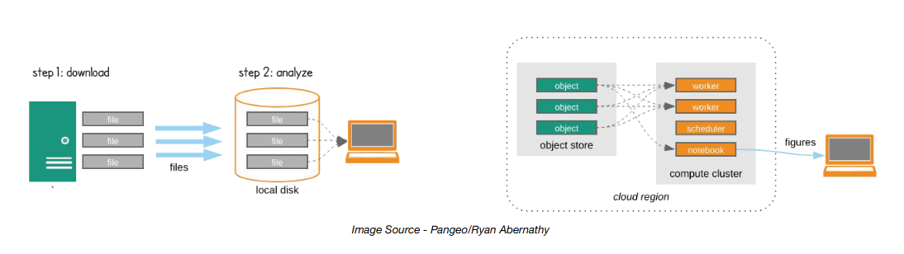
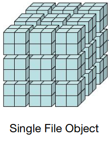
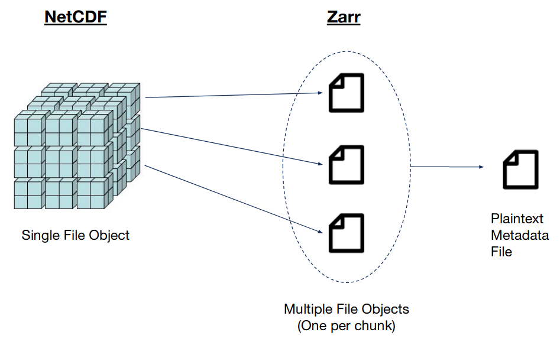
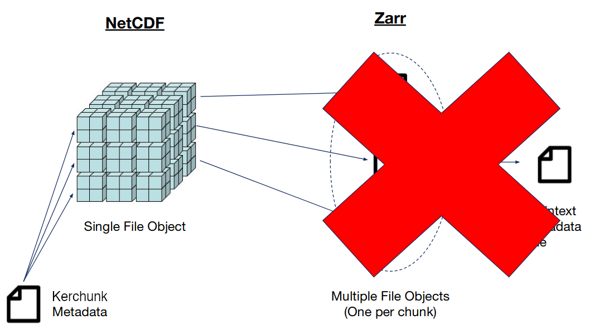
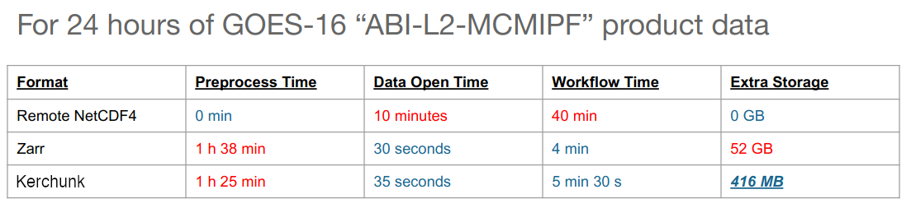

# Kerchunk Demo - 2024 EDMW Workshop
__This presentation is based on work I did during the [NCAR Summer Internship in Parallel Computational Science (SIParCS) program in 2021](https://www2.cisl.ucar.edu/siparcs)__
### Lucas Sterzinger -- Scientific Software Developer - [NASA GES DISC](https://disc.gsfc.nasa.gov)
* [Twitter](https://twitter.com/lucassterzinger)
* [GitHub](https://github.com/lsterzinger)
* [Website](https://lucassterzinger.com)

## Repo Contents:
| File | Description |
|-:|:-|
|[01-Create_References.ipynb](./01-Create_References.ipynb)| Listing files in S3, creating kerchunk references, parallelization, reference file aggregation|

##  Motivation:
* NetCDF is not cloud optimized
* Other formats, like Zarr, aim to make accessing and reading data from the cloud fast and painless
* However, most geoscience datasets available in the cloud are still in their native NetCDF/HDF5, so a different access method is needed

## What do I mean when I say "Cloud Optimized"?

In traditional scientific workflows, data is archived in a repository and downloaded to a separate computer for analysis (left). However, datasets are becoming much too large to fit on personal computers, and transferring full datasets from an archive to a seperate machine can use lots of bandwidth.

In a cloud environment, the data can live in object storage (e.g. AWS S3), and analysis can be done in an adjacent compute instances, allowing for low-latency and high-bandwith access to the dataset.

### Why NetCDF doesn't work well in this workflow

NetCDF is probably the most common binary data format for atmospheric/earth sciences, and has a lot of official and community support. However, the NetCDF format/API requires either a) many small reads to access the metadata for a single file or b) use a serverside utility like THREDDS/OPeNDAP to extract metadata.

### The Zarr Solution
The [Zarr data format](https://zarr.readthedocs.io/en/stable/) alleviates this problem by storing the metadata and chunks in seperate files that can be accessed as-needed and in parallel. Having consolidated metadata means that all the information about the dataset can be loaded and interpreted in a single read of a small plaintext file. With this metadata in-hand, a program can request exactly which chunks of data are needed for a given operation.

### _However_
While Zarr proves to be very good for this cloud-centric workflow, most cloud-available data is currently only available in NetCDF/HDF5/GRIB2 format. While it would be _wonderful_ if all this data converted to Zarr overnight, it would be great if in the meantime there was a way to use some of the Zarr spec, right?

## Introducting `kerchunk`
[Github page](https://github.com/intake/kerchunk)

`kerchunk` works by doing all the heavy lifting of extracting the metadata, generating byte-ranges for each variable chunk, and creating a Zarr-spec metadata file. This file is plaintext and can opened and analyzed with xarray very quickly. When a user requests a certain chunk of data, the NetCDF4 API is bypassed entirely and the Zarr API is used to extract the specified byte-range.

### How much of a difference does this make, really?
Testing this method on workflow processing of 24 hours of 5-minute GOES-16 data and accessing via native NetCDF, Zarr, and NetCDF + ReferenceMaker:

*Notebooks used to benchmark these times are available here: https://github.com/lsterzinger/cloud-optimized-satellite-data-tests*